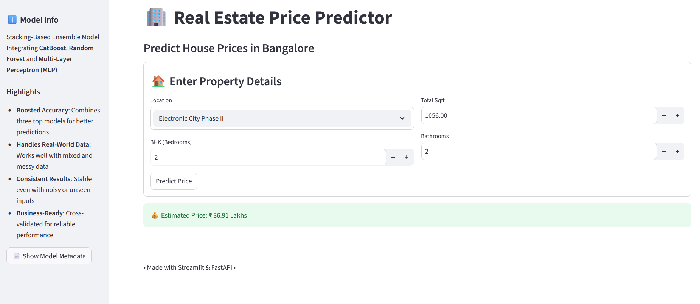

# Real Estate Price Prediction


A comprehensive machine learning project for predicting real estate prices using advanced regression algorithms.

---

## Table of Contents

- [Overview](#overview)
- [Features](#features)
- [Project Structure](#project-structure)
- [Installation](#installation)
- [Usage](#usage)
  - [Jupyter Notebook](#jupyter-notebook)
  - [Streamlit App](#streamlit-app)
  - [API Usage](#api-usage)
- [Model Performance](#model-performance)
- [UI Preview](#UI-Preview)
- [Data](#data)
- [Contributing](#contributing)
- [Contact](#contact)

---

## Overview

This project aims to predict real estate prices using advanced regression techniques. It provides a complete workflow from data preprocessing to model deployment, supporting multiple machine learning algorithms (Final model is stacking of **XGBoost** and **CatBoost**).

---

## Features

- **Multiple algorithms**: Linear Regression,Decision Tree, Random Forest,ExtraTree,AdaBoost,Gradient, XGBoost,CatBoost.
- **Comprehensive data preprocessing**: Missing value handling, outlier detection, feature engineering.
- **Web app deployment**: FastAPI and Streamlit interfaces for user interaction.
- **API support**: Used FastAPI for API endpoints.
- **Model evaluation**: Performance metrics and visualization.

---

## Project Structure

```
Real-Estate-Price-Prediction/
├── app/                 # Web application code (Flask, Streamlit)
├── data/                # Raw and processed datasets
├── logs/                # Log files
├── model_artifacts/     # Saved models and artifacts
├── notebooks/           # Jupyter notebooks for exploration and training
├── reports/             # Model evaluation reports and visualizations
├── requirements.txt     # Python dependencies
└── .gitignore           # Files and directories to ignore
```

---

## Installation

1. **Clone the repository:**

```bash
git clone https://github.com/rohitkr8527/Real-Estate-Price-Prediction.git
cd Real-Estate-Price-Prediction
```

2. **Create a virtual environment (recommended):**

```bash
python -m venv venv
source venv/bin/activate      # On Windows: venv\Scripts\activate
```

3. **Install dependencies:**

```bash
pip install -r requirements.txt
```

---

## Usage

### Jupyter Notebook

* Explore and train models using Jupyter notebooks in the `notebooks/` directory.
* Start Jupyter:

```bash
jupyter notebook
```

### Streamlit App

* Navigate to the `app/streamlit_app/` directory.
* Run the Streamlit app:

```bash
streamlit run app.py
```

### API Usage

* Start the Flask API server as above.
* Send a POST request to `/predict` with a JSON payload:

```json
{
  "area": 1500,
  "bedrooms": 3,
  "bathrooms": 2,
  "location_score": 8
}
```
## UI Preview



---
## Model Performance

| Model         | RMSE      | R² Score |
| ------------- | --------- | -------- |
| XGBoost       | 19.55     | 0.6663   |
| CatBoost      | 19.99     | 0.6508   |
| Stacked Model | 17.41     | 0.7243   |

---
## Data

- **Raw data:** `data/raw/`
- **Processed data:** `data/processed/`

---

## Contributing

1. **Fork the repository.**
2. **Create a new branch (`git checkout -b feature/your-feature`).**
3. **Commit your changes (`git commit -am 'Add some feature'`).**
4. **Push to the branch (`git push origin feature/your-feature`).**
5. **Open a pull request.**

---

## Contact

- [**Email** ](rohitkr7518@example.com)
-  [**GitHub**](https://github.com/rohitkr8527)


